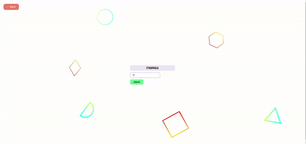

# Angul-It: Multi-Stage Captcha Web Application

## Overview

Angul-It is a sophisticated multi-stage captcha web application built using the latest version of Angular. It challenges users with various types of captchas, including image identification, math problems, and text input. The application features robust form validation, state management, and a results page.

## Features

- Multiple captcha challenges
- Ability to revisit previous stages
- Form validation for each challenge
- State management to preserve user progress
- Results page showing challenge outcomes
- Responsive design for desktop and mobile
- Animations for smooth transitions between challenges

## Prerequisites

- Node.js (v14 or later)
- npm (v6 or later)
- Angular CLI (latest version)

## Setup

1. Clone the repository:
   ```
   git clone https://github.com/alpapie/angul-it.git
   cd angul-it
   ```

2. Install dependencies:
   ```
   npm install
   ```

3. Start the development server:
   ```
   ng serve 
   ```

4. Open your browser and navigate to `http://localhost:4200`

## Project Structure

```
├── app.component.html
├── app.component.ts
├── app.config.ts
├── app.routes.ts
├── captcha-component/
│   ├── click-captcha-component/
│   ├── math-captcha-component/
│   ├── rotate-captcha-component/
│   └── text-captcha-component/
├── home-component/
├── not-fund-component/
└── result-component/
```

## Usage

1. Start from the home page 
2. Complete each captcha challenge as presented
3. Navigate between challenges using the provided controls
4. View your results on the final page after completing all challenges


## Contributing

1. Fork the repository
2. Create a new branch: `git checkout -b feature-branch-name`
3. Make your changes and commit them: `git commit -m 'Add some feature'`
4. Push to the branch: `git push origin feature-branch-name`
5. Submit a pull request


